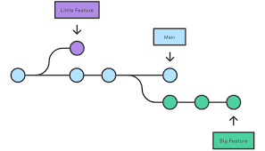

## Git Branching


1. Initialize git with main branch

   ```py
   git init -b main

   # git pull origin main --allow-unrelated-histories
   ```

2. Create hello.txt file and type version 1
3. Save the first version and commit

   ```py
   git add hello.txt
   git commit -m 'message' # [--amend]
   ```

4. Save the second version and commit

   ```py
   git add .
   git commit -m 'message'
   ```

5. Save the third version and commit

   ```py
   git add .
   git commit -m 'message'
   ```

6. Check the current git log

   ```py
   git log --all --graph
   # always use the followings:
   # git log --oneline
   # git status
   ```

7. Creating a new branch for a big feature, and it copies all content of your current branch.

   ```py
   git branch branch-name
   git checkout branch-name
   # git branch -c branch-name
   ```

   \
   

8. Add feature file and commit 1
9. Add and commit feature

   ```
   git add .
   git commit -m 'message'
   ```

10. Change to commit 2, add and commit

    ```
    git add .
    git commit -m 'message'
    ```

11. Switch back to main and do bug fix

    ```py
    # press Q to exit git log
    git checkout main
    git log --all --graph
    ```

12. Add bugfix file, add, and commit

    ```py
    git add .
    git commit -m 'message'
    ```

## Git Merging

Switch to feature branch, add, commit, and merge it into main branch


## Git Conflict


1. Create another branch and change the same line on two branches (conflict and main)
2. For final code, delete everything else (arrows, heads, and equals) except what we want
3. To finish the merging, add and commit the final change

## Git Workflow

When working on a new feature, you may want another developer to look at your code, which is called `code review`.

1. Create a feature branch
2. Upload feature branch to GitHub
3. Create a `Pull Request` to do code review
4. Merge feature branch into main branch

   ```
   git branch -m new-feature
   git status
   git add .
   git commit -m 'message'

   git remote add origin url
   git checkout main
   git push -u origin main

   git checkout new-feature
   git push -u origin new-feature
   ```
